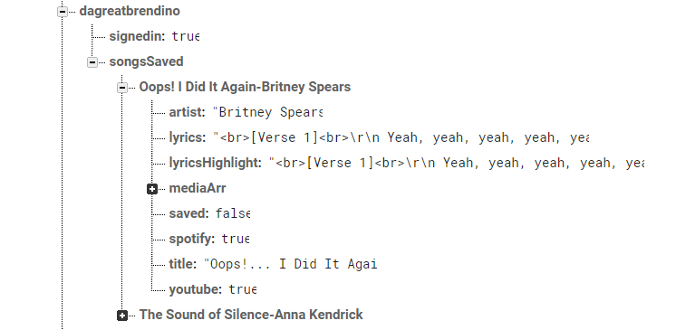
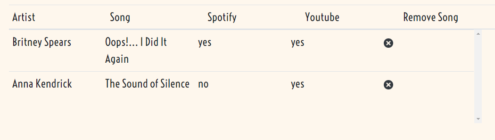

# whatsThatSong
## Overview
Have you ever had some lyrics to a song stuck in your head but you just couldn't remember the name of the song? What's That Song! is an app that aims to solve that issue. To use, simply type the lyric except in question into the search bar and press the "Give it to me!" button. You will recieve 5 matching songs for those lyrics. Click on a song to display it's full lyrics along with a link to Youtube and Spotify if they are available. The user can return to the search results if the one they are looking at turns out to be the wrong song.  

Dont forget to create an account so that you can bookmark songs and return to them later! 
## Technical Aspects
### [Audd.io API](https://audd.io/)
Audd.io is an API has a community maintained database of over 4 million tracks! The API provides a *findLyrics* paramater that uses a GET method to retrieve song objects based on a lyric excerpt. The response stores the song objects in an array *results*. The necessarry properties that are accessed for use in this project are *artist*, *title*, *lyrics*, and *media*. A search for the query "Oops I did it again" would return an array of song objects one of which is shown below.
``` javascript
result[i] = {
artist: "Britney Spears"
...
lyrics: [Verse 1]
Yeah, yeah, yeah, yeah, yeah, yeah
...
Oh, baby baby
[Chorus]
Oops, I did it again
I played with your heart
...

media: "[{"provider":"youtube","start":0,"type":"video","url":"http:\/\/www.youtube.com\/watch?v=CduA0TULnow"},     {"provider":"apple_music","provider_id":"269969904","type":"audio","url":"https:\/\/itunes.apple.com\/lookup?entity=song&id=269969904"},  {"native_uri":"spotify:track:6naxalmIoLFWR0siv8dnQQ","provider":"spotify","type":"audio","url":"https:\/\/open.spotify.com\/track\/6naxalmIoLFWR0siv8dnQQ"}]"
title: "Oops!... I Did It Again"
}
```
Sometimes the media propetry cannot be properly parsed into a JSON object in which case the user will not be presented with links to Youtube and Spotify. 
### Firebase
Firebase is utilzed to allow users to make an account so that they can save songs to be viewed again later. This project utilizes the *Auth()* method of firebase to create and sign in users. Upon succesfully creating an account, users will be given a directory associated with their username in our database. The songs the user choses to save will be stored in a directory called songsSaved.

When a user saves a song, all of the information that was retreived from the API call is saved in database. Below is an example of what this looks like in firebase. 

#### Accessing Saved Songs
The saved songs are brought into the client side and stored in an array whenever a user signs in. This array gets updated anytime the firebase database reference savedSongs is updated. Users access this array by clicking the saved songs button near the search bar. This will open a table with all of the user's saved songs. Users can click on songs to access them again or remove them from their saved songs by clicking the x. 

### jQuery
The jQuery library is utilized for capturing user input, and DOM manipulation. Most of the functionality of this app is powered by jQuery event listeners that call the relevant functions when certain elements are clicked. 
### Javascript
Native javascript is used to store necessary data on the client side. This project utilizes arrays and objects to store data from the Audd.io API and Firebase. Below is a brief description of the functions. For a more detailed explaination of each function read the comments in the source code.
* **signup(email, password, disName)** - this fucntion takes three arguments and attempts to use Firebase.Auth() to create a user account with the given credentials
* **signin(email, password)** - this function takes the given credentials and attempts to sign a user in 
* **signout()** - this function signs a user out and refreshes the page
* **saveSong(song)** - this function will save the invoking song to the user's songsSaved directory in firebase
* **unSaveSong(song)** - this function will remove the invoking song from the user's songsSaved directory
* **getSongsByLyrics(query)** - this function will retreive songs using the Audd.io API with the provided query and then call the function resultsToDisplay()
* **resultsToDisplay()** - this function will display the search results the results to the DOM
* **validator()** - this function will remove any database unfriendly characters from the song title and artist name so that they can always be saved to the database
* **savedToDisplay()** - this function will get all of the signed in user's saved songs and display them in a table

### Animate
The animate.js library is used to make records spin. This spinning image is used as a loading icon while the Audd.io API attempts to retrieve results. 

### CSS
The Bootstrap grid used to make the layout responsive and simple. Modals are also used to make the sign up/sign in feature more well presented. 


